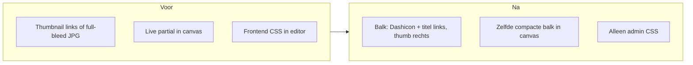

# ACF Section Editor UX Playbook

Herbruikbaar, **editor-only** playbook voor WordPress themes met **section-based ACF Gutenberg blocks** (PHP partials in `sections/{slug}/`). Geldt voor elke codebase die preview-JPG's onderhoudt in `sections/{slug}/preview/{slug}.jpg`.

**Doel:** betere editor-UX zonder frontend-impact — compacte balk (Dashicon + titel links, preview-thumbnail rechts), geen live frontend-styling in admin.

**Referentie-implementatie (section-based):** technosapiens-theme — `inc/features/section-reference/` + `sections/*/preview/`. Bevindingen uit Lichtstad Verloskundigen (2026-09) zijn in dit playbook verwerkt.

---

## Wanneer dit playbook geldt

| Architectuur | Preview-pad | Dit playbook |
|---|---|---|
| **Section-based** (`sections/{slug}/`) | `sections/{slug}/preview/{slug}.jpg` | **Ja — volledig** |
| **Module-based** (`modules/{slug}/`) | `modules/{slug}/preview/module-{slug}.jpg` | Alleen Phase 1 (balk-thumbnail) + Phase 3; canvas-logica in module templates |
| **Geen preview-JPG's** | — | Alleen Phase 3 + ACF v3 config; overweeg title+icon placeholder (ander playbook) |

---

## Probleem

Op **WordPress 7.1+** met **ACF PRO 6.8.7+** (aanbevolen 6.8.9) en **Blocks v3**:

1. ACF-velden verschijnen dubbel (sidebar + Expanded Editor)
2. Preview-JPG's staan vaak **links** in de groepbalk (`padding-left` + `background-image`) — moet **rechts**
3. Canvas rendert **live frontend partials** + laadt **frontend CSS/JS in admin** — traag en verwarrend
4. Thumbnails kunnen de balk **vergroten** (`min-height` forcing) of de **hele balk vervangen** door een full-bleed JPG
5. Field groups hebben vaak **geen accordion-veld** — dan is er geen groepbalk om de thumbnail in te zetten
6. ACF v3 vangt canvas-HTML via **output buffering** — `return` zonder `echo` toont niets

Geen impact op frontend render, field data, of opslaan.



---

## Prerequisites (per site)

| Vereiste | Waarom |
|---|---|
| **WordPress 7.1+** | ACF 6.8.9 default naar Blocks v3 |
| **ACF PRO 6.8.7+** (pin 6.8.9) | v3, Expanded Editor, `hide_fields_in_sidebar` |
| **Blocks v3 actief** | Inspector toont **Open Expanded Editor** |

Controleer dat blocks niet `'acf_block_version' => 1|2` pinnen, tenzij bewust.

---

## Phase 0 — Audit (per site)

Zoek en noteer project-specifieke paden:

```bash
# Preview images
find {theme}/sections -path "*/preview/*.jpg"

# Admin frontend asset loading
rg "enqueue_block_assets|is_admin\(\)" {theme}/
rg "initReferenceSectionFrontendAssets|initModuleAssets" {theme}/

# Bestaande balk-thumbnail CSS
rg "accordion-title|accordion-preview|background-image.*preview" {theme}/

# Render callback preview guards
rg "\$is_preview|\$isExample|is_example" {theme}/

# Hebben field groups accordion-velden?
rg '"type": "accordion"' {theme}/sections {theme}/acf-json

# Block icon slugs (Dashicons)
rg "registerReferenceSection\(" {theme}/sections -A 3
```

Noteer:
- Block namespace: vaak `acf/section-{SECTION_ID}` (bijv. `acf/section-section-usps` als `SECTION_ID = section_section_usps`), niet altijd `acf/section-{slug}`
- Of field groups **accordion-velden** hebben; zo niet → Phase 1e (injectie)
- Shared field groups met meerdere block-locations of `value: "all"` (geen per-sectie accordion injecteren)
- CSS/JS enqueue hooks (admin vs frontend)
- Gutenberg SCSS entry file (`*-gutenberg.scss`, `admin-gutenberg-editor.scss`, etc.)
- Dashicon slug per sectie (2e argument van `registerReferenceSection`)

---

## Phase 1 — Preview-thumbnail rechts in de ACF-groepbalk

**Doel:** Compacte balk: **Dashicon + titel links**, kleine preview **rechts**, **niet hoger dan de balk**. De thumbnail vervangt de balk niet.

### 1a. Preview-pad conventie

```
{theme}/sections/{slug}/preview/{slug}.jpg
```

Generieke helpers (pas namespace/class names aan per theme):

```php
function get_section_preview_url(string $slug): string {
    return get_stylesheet_directory_uri() . "/sections/{$slug}/preview/{$slug}.jpg";
}

function has_section_preview(string $slug): bool {
    return file_exists(get_stylesheet_directory() . "/sections/{$slug}/preview/{$slug}.jpg");
}

function get_section_slugs_with_previews(): array {
    // Scan sections/ directory; return slugs where preview JPG exists
}
```

Sla het **Dashicon** op bij block-registratie (slug zoals `yes-alt`, `text`, `megaphone`) in een registry keyed by section slug. Sanitize: alleen `[a-z0-9-]`, strip optioneel prefix `dashicons-`.

### 1b. CSS-strategie (generiek)

**Anti-patterns verwijderen:**
- `padding-left: 10rem` (reserverde ruimte links)
- `background-image` direct op `.acf-accordion-title` (plaatst image links)
- `min-height: 5rem` (forceert onnodige balkhoogte)
- `height: 100%` op `::after` — **collapse naar 0** als de titel geen expliciete hoogte heeft; gebruik een **vaste hoogte** (bijv. `3rem`)
- Full-bleed `` als canvas-preview (vervangt de hele balk)

**Aanbevolen patroon:** flex op titel + Dashicon via `::before` + thumbnail via `::after` rechts:

```css
.acf-accordion-title {
  display: flex;
  align-items: center;
  justify-content: space-between;
  gap: 0.75rem;
}

.acf-accordion-title::before {
  flex: 0 0 auto;
  font-family: dashicons;
  font-size: 1.25rem;
  line-height: 1;
  width: 1.25rem;
  height: 1.25rem;
  speak: never;
  /* content: "\f12a"; per slug via PHP uit wp-includes/css/dashicons.css */
}

.acf-accordion-title::after {
  content: "";
  flex: 0 0 auto;
  align-self: center;
  height: 3rem;                  /* vaste hoogte — niet height: 100% */
  width: 5rem;
  margin-left: auto;
  background-image: url("{preview-url}");
  background-repeat: no-repeat;
  background-position: center right;
  background-size: contain;
}
```

ACF's accordion-caret is een **aparte SVG** (`.acf-accordion-icon`), niet `::before` op de titel — `::before` is vrij voor het Dashicon.

**Waarom `::after` i.p.v. `background-position: right`:**
- Titeltekst overlapt de thumbnail niet
- Vaste `height` + `contain` garandeert hoogte-constraint
- `margin-left: auto` duwt naar rechts zonder layout-hacks

**Dashicon-content:** parse `wp-includes/css/dashicons.css` (`.dashicons-{slug}:before { content: "\fxxx"; }`) i.p.v. een hardcoded unicode-tabel. Enqueue `dashicons` in de editor iframe via `enqueue_block_assets` + `is_admin()` — anders is het icoon leeg in de Gutenberg iframe.

### 1c. DOM-selectors (ACF Block v3)

Target de accordion-titel in de block editor (pas block namespace aan):

```css
/* Via wrapper class op accordion field */
.acf-field.{prefix}-accordion-preview--{slug} > .acf-accordion-title

/* Direct via block data-type — let op: data-type is vaak acf/section-{SECTION_ID} */
.block-editor-block-list__block[data-type="acf/section-{section-id}"]
  .acf-block-fields > .acf-field.acf-accordion .acf-accordion-title
```

Genereer CSS per slug met preview-JPG **en** Dashicon-content (PHP loop).

### 1d. PHP wiring (generiek patroon)

1. **Filter** `acf/prepare_field/type=accordion` → voeg wrapper class `{prefix}-accordion-preview--{slug}` toe
2. **Slug resolutie** via field group location `param: block`. Alleen toewijzen als er **precies één** `acf/section-*` location is. Skip `value: "all"` en groepen die aan meerdere secties hangen (shared "Sectie - Instellingen")
3. **Enqueue** inline CSS via `admin_enqueue_scripts` **én** `enqueue_block_editor_assets` (iframe); scope selectors met `.wp-block-post-content, .block-editor-iframe__html`

### 1e. Geen ACF layout-accordion in field groups

De canvas-balk (Phase 2) vervangt de groepbalk. **Voeg geen accordion-velden toe** aan section field groups (niet in JSON, niet runtime).

Als eerdere injectie (`field_{prefix}_section_ref_acc_*`) in JSON of de database staat:

1. Verwijder die velden uit `sections/*/acf-json/*.json`
2. Strip ze runtime via `acf/load_fields` tot de JSON gesynct is
3. Sync field groups (`update-acf-groups.php` of ACF sync UI)

Niet schrijven naar ACF JSON als nieuwe accordion. Frontend field groups / save logic blijven verder ongewijzigd.

---

## Phase 2 — Compacte canvas-balk i.p.v. live frontend-render

**Doel:** Canvas toont dezelfde **compacte balk** als de ACF-groepbalk (icon + titel + thumb), géén full-bleed JPG en géén volledige sectie-HTML.

### 2a. Render callback guard (generiek)

ACF v3 vangt preview-HTML met `ob_start()` / `ob_get_clean()` in `acf_rendered_block_v3()`. **`return` zonder `echo` is onzichtbaar in de canvas.** Partials die `Partial::render(..., $output = true)` gebruiken werken wél omdat zij echoën.

```php
public function render(array $block, string $content = '', bool $is_preview = false, int $post_id = 0): string {
    $isExample = !empty($block['data']['is_example']);

    if (($isExample || $is_preview) && has_section_preview($slug)) {
        $bar = render_editor_bar($slug, $label); // icon + titel + thumb
        echo $bar;
        return $bar;
    }

    return render_section_partial($slug, ...); // deze echo't intern
}

function render_editor_bar(string $slug, string $label): string {
    $icon = esc_attr(get_section_icon($slug));
    return '<div class="{prefix}-editor-bar">'
        . '<span class="{prefix}-editor-bar__title">'
        . '<span class="{prefix}-editor-bar__icon dashicons dashicons-' . $icon . '" aria-hidden="true"></span>'
        . '<span class="{prefix}-editor-bar__label">' . esc_html($label) . '</span>'
        . '</span>'
        . ''
        . '</div>';
}
```

| Context | Flag | Output |
|---|---|---|
| Block inserter | `$isExample` / `is_example` | Compacte balk (echo) |
| Editor canvas (preview mode) | `$is_preview === true` | Compacte balk (echo) |
| Frontend | `$is_preview === false` | Volledige partial |

### 2b. Block mode

Houd `'mode' => 'preview'` zolang de render callback bij `$is_preview` de balk teruggeeft. `'mode' => 'edit'` toont velden inline in canvas — vermijd dit.

### 2c. Canvas-balk styling (SCSS)

```scss
.{prefix}-editor-bar {
  display: flex;
  align-items: center;
  justify-content: space-between;
  gap: 0.75rem;
  box-sizing: border-box;
  width: 100%;
  min-height: 3rem;
  padding: 0.625rem 1rem;
  background: #f4f4f4;
  border: 1px solid #ccd0d4;

  &__title {
    display: flex;
    align-items: center;
    gap: 0.5rem;
    flex: 1 1 auto;
    min-width: 0;
  }

  &__icon {
    flex: 0 0 auto;
    width: 1.25rem;
    height: 1.25rem;
    font-size: 1.25rem;
    line-height: 1;
  }

  &__label {
    flex: 1 1 auto;
    min-width: 0;
    font-weight: 600;
  }

  &__thumb {
    flex: 0 0 auto;
    display: block;
    height: 3rem;
    width: 5rem;
    object-fit: contain;
    object-position: center right;
  }
}
```

Gebruik het **bestaande block-icon** uit `acf_register_block_type` / `registerReferenceSection($description, $icon)` — niet een tweede icoon-set.

---

## Phase 3 — Frontend-styling in admin verwijderen

> **Belangrijk:** In themes waar frontend-styling bewust in de admin werd geladen (live WYSIWYG preview), **komt dit te vervallen**. De editor toont admin-UI + compacte preview-balken.

### 3a. Per-block frontend assets: admin-tak verwijderen

Zoek en verwijder patronen als:

```php
add_action('enqueue_block_assets', function () {
    if (is_admin()) {
        enqueue_section_frontend_styles($slug);  // ← VERWIJDEREN
    }
});
```

Frontend assets blijven laden via `wp_enqueue_scripts` + `has_block()` check op de live site.

**Wél** in admin/iframe laden: `dashicons` (voor balk-iconen).

### 3b. Frontend SCSS uit Gutenberg/admin bundle halen

In het theme's gutenberg SCSS entry bestand (`*-gutenberg.scss`, `editor.scss`, etc.) **verwijderen**:

- Atomic/layout SCSS (containers, margins, grids)
- Component SCSS (typography, buttons, forms, swiper, etc.)
- Per-section frontend styles
- Vendor CSS alleen nodig op frontend

**Behouden:**

- Admin/editor-specifieke styles (ACF panel tweaks, editor-balk, paginatitel font)
- Balk-thumbnail + Dashicon CSS (Phase 1–2)

### 3c. Frontend templates ongewijzigd

Partials in `sections/{slug}/partials/` blijven intact. Alleen admin preview-gedrag verandert.

### 3d. Optioneel behouden (admin UI, geen frontend)

- Paginatitel font in editor (CSS vars / theme heading font)
- ACF button styling overrides
- Preview link click prevention (`ts-preview-link` patroon)

Dit is **editor chrome**, geen sectie-frontend.

---

## Phase 4 — ACF Blocks v3 configuratie

Per block registratie (of globaal via filter):

```php
acf_register_block_type([
    'api_version'           => 3,
    'acf_block_version'     => 3,
    'hide_fields_in_sidebar' => true,
    'mode'                  => 'preview',
    // ...
]);
```

**Globale fallback** (in theme `functions/acf.php` of equivalent):

```php
add_filter('acf/register_block_type_args', function ($block) {
    $block['hide_fields_in_sidebar'] = true;
    return $block;
});
```

**Tijdelijk** (alleen als ACF < 6.8.9):

```php
add_filter('acf/blocks/default_block_version', fn() => 3);
```

---

## Phase 5 — Verificatie (per site)

- [ ] Elke sectie met preview-JPG: compacte balk met **Dashicon + titel links**, thumbnail **rechts**
- [ ] Thumbnail **niet hoger** dan balk; **geen** full-bleed JPG die de balk vervangt
- [ ] `::after` zichtbaar (vaste hoogte, niet `height: 100%`)
- [ ] Canvas: zelfde compacte balk, geen gestylde frontend-sectie
- [ ] Block inserter: balk/thumbnail zichtbaar (HTML wordt ge-echo'd)
- [ ] Field groups: **geen** layout-accordion in Expanded Editor (alleen echte contentvelden)
- [ ] Shared groepen (meerdere blocks / `all`): géén verkeerde sectie-thumbnail
- [ ] Sidebar: alleen **Open Expanded Editor** (+ Gutenberg Advanced)
- [ ] Expanded Editor: alle velden bereikbaar, opslaan werkt
- [ ] Frontend na opslaan **ongewijzigd**
- [ ] Gutenberg CSS bundle kleiner na SCSS-slimming
- [ ] Dashicons zichtbaar in editor iframe
- [ ] Asset build gedraaid (`npm run build` of theme-equivalent)

---

## Rollout checklist (andere codebase)

1. **Audit** (Phase 0): paden, hooks, namespace, accordion-aanwezigheid, icon slugs
2. **Preview helpers** + icon-registry (URL, exists, slug scan, Dashicon)
3. **Balk-thumbnail CSS** (Phase 1): rechts via `::after` met vaste hoogte; Dashicon `::before`; verwijder left-padding anti-pattern
4. **Geen ACF layout-accordion** in section field groups; strip injecties `field_*_section_ref_acc_*` indien aanwezig
5. **Render guard** (Phase 2): `$is_preview || $isExample` → compacte balk, **echo + return**
6. **Admin frontend assets verwijderen** (Phase 3); `dashicons` wél enqueue'en in iframe
7. **ACF v3 config** bevestigen (Phase 4)
8. **Verificatie** (Phase 5)
9. **Build** en deploy

---

## Wat dit playbook expliciet NIET doet

| Onderwerp | Beslissing |
|---|---|
| Full-bleed JPG als canvas-preview | **Nee** — compacte balk (icon + titel + thumb) |
| JPG vervangen door title+icon zonder preview-bestand | **Nee** — JPG's blijven; andere playbook voor module-based themes zonder JPG's |
| Frontend typography in editor canvas | **Nee** — frontend styling in admin vervalt |
| ACF layout accordion fields in section JSON | **Nee** — canvas-balk volstaat; strip injecties als ze per ongeluk zijn opgeslagen |
| Frontend templates of field groups wijzigen | **Nee** |
| Front-end Bootstrap/content accordions | **Nee** — alleen admin balk-thumbnails |

---

## Architectuur-varianten

### Section-based (primair)

```
sections/
  section-{name}/
    preview/section-{name}.jpg    ← balk + canvas thumbnail
    partials/section-{name}.php   ← frontend render
    acf-json/section-{name}.json
    Section{Name}.php             ← block registration + Dashicon slug
```

Typische centralisatie: `{prefix}/SectionReferenceTrait.php`, `SectionReferencePartial.php`, `SectionReferenceEditor.php`.

### Module-based (secundair)

```
modules/
  module-{name}/
    preview/module-{name}.jpg
    module-{name}.php
```

Zelfde balk-thumbnail CSS (Phase 1) en admin asset cleanup (Phase 3). Canvas guard staat per module template (`$is_preview` early return + echo).

---

## Security (kort)

- Preview URLs via `esc_url()`; slug uit trusted registry (directory scan), niet user input
- Dashicon slugs sanitizen (`[a-z0-9-]`); `esc_attr()` in class names
- `alt=""` op decoratieve preview images; `aria-hidden="true"` op balk-iconen
- Geen wijziging aan capabilities of save logic
- Geen user-controlled HTML in accordion labels (label blijft `esc_html` / ACF field title)

---

## Referentie-implementaties

| Theme | Architectuur | Relevante bestanden |
|---|---|---|
| technosapiens (section-based) | `sections/` + trait | `inc/features/section-reference/SectionReferencePartial.php`, `SectionReferenceTrait.php`, `SectionReferenceEditor.php` |

Gebruik alleen Techno Sapiens-patronen in dit project. Pas class names, prefixes en block namespace aan per section.
