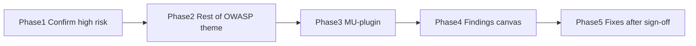

# OWASP Top 10:2025 review — phased plan

Scope is source review of [`public/wp-content/themes/technosapiens`](public/wp-content/themes/technosapiens) and [`public/wp-content/mu-plugins/acf-options-for-polylang`](public/wp-content/mu-plugins/acf-options-for-polylang) against the [OWASP Top 10:2025](https://top10.owasp.org/2025/) list. Out of scope unless they interact with that code: WordPress core, other plugins (Defender, Gravity Forms, ACF Pro, Polylang), hosting/TLS, and CI secrets.

Method: static review of trust boundaries (HTTP in, REST, admin GET/POST, templates, emails, JS). No exploit PoCs. Findings will be mapped to A01–A10 with severity, file:line, and a recommended fix. The durable report is a canvas at [`owasp-top10-2025-review.canvas.tsx`](/Users/thijsdejong/.cursor/projects/Users-thijsdejong-websites-technosapiens-wp-starter/canvases/owasp-top10-2025-review.canvas.tsx).

## Phase 1 — Confirm high-risk access control and injection

Re-read and classify the surfaces already flagged. Goal: confirm or dismiss each as a real finding, not just a smell.

- **A01 IDOR:** [`GravityFormsTrackingComponent.php`](public/wp-content/themes/technosapiens/inc/app/integrations/GravityFormsTrackingComponent.php) loads any GF entry from `?ts-form-entry-id=` and pushes field values into `dataLayer` with no auth/token. Confirm which field types are included vs `$doNotTrackTypes`.
- **A01 public REST:** [`GetItemsRestRoute.php`](public/wp-content/themes/technosapiens/inc/app/rest/GetItemsRestRoute.php) uses `permission_callback => '__return_true'`, accepts any `pt`, unbounded `ppp`, returns HTML in `featuredImageTag`. Check whether this is consumed by a section or dead code.
- **A01 CSRF:** [`AdminBarLightComponent.php`](public/wp-content/themes/technosapiens/inc/core/components/AdminBarLightComponent.php) changes user meta from a GET query with no nonce (role-gated, still CSRF).
- **A01 privilege design:** [`OwnerRoleComponent.php`](public/wp-content/themes/technosapiens/inc/app/admin/OwnerRoleComponent.php) clones administrator minus a denylist and auto-syncs new caps.
- **A05 XSS / injection:** search and archive templates that echo `$_GET` / titles / URLs without `esc_html` / `esc_url` / `urlencode`; GF email templates [`gf-admin.php`](public/wp-content/themes/technosapiens/partials/email/php/gf-admin.php) and [`gf-customer.php`](public/wp-content/themes/technosapiens/partials/email/php/gf-customer.php); `unserialize()` of GF stored values.

Stop after this phase if any finding is Critical so the canvas can highlight it first.

## Phase 2 — Remaining OWASP categories for the theme

Walk A02–A04 and A06–A10 against the rest of the theme. Expected coverage, not a full rewrite:

- **A02 Misconfiguration:** debug/`DEV` gates ([`Log.php`](public/wp-content/themes/technosapiens/inc/core/utils/Log.php), live-reload JS, GF mail `file_put_contents`), missing security headers in theme code, generator removal in [`ThemeOptimization.php`](public/wp-content/themes/technosapiens/inc/app/performance/ThemeOptimization.php). Note what WP Defender / the server already cover; do not audit Defender.
- **A03 Supply chain:** [`package.json`](package.json) / [`composer.json`](composer.json) pin vs caret ranges, no SBOM/SCA in-theme, vendored JS (swiper, vimeo, youtube-player).
- **A04 Crypto:** ACF-stored Maps/Mapbox keys, TLS/HSTS (hosting, not theme), `md5` cache keys (non-crypto — likely not a finding).
- **A06 Insecure design:** GF tracking via guessable URL, search `posts_per_page => -1`, owner-as-near-admin, no rate limits on REST/search.
- **A07 Authentication:** no custom login; rely on WP. Check session/cookie handling in theme (likely none). Owner vs admin is authorization, reported under A01/A06.
- **A08 Integrity:** unserialize of stored GF data, webpack assets without SRI, no signed update path for the theme.
- **A09 Logging/alerting:** `Log::log` is debug-only; no security-event logs for REST abuse, failed access, or GF tracking IDOR attempts.
- **A10 Exceptional conditions:** `@file_get_contents` in [`JsonFetchComponent.php`](public/wp-content/themes/technosapiens/inc/core/components/JsonFetchComponent.php), fail-open REST params, unbounded queries.

Escaping in existing templates is only a finding when user-controlled data actually reaches HTML/JS/email. Per [015](.cursor/rules/015-code-formatting-consistency.mdc), mass-escaping working output is out of scope for later fixes.

## Phase 3 — ACF Options for Polylang mu-plugin

This plugin is filter-only (no REST/AJAX of its own). Confirm and document:

- Cross-language fallback on empty values (by design; possible data exposure).
- REST uses `get_locale()` instead of Polylang language ([`classes/main.php`](public/wp-content/mu-plugins/acf-options-for-polylang/classes/main.php)).
- Unescaped admin notice ([`classes/admin.php`](public/wp-content/mu-plugins/acf-options-for-polylang/classes/admin.php)).
- Unmaintained third-party: v1.1.11 (2023), tested to WP 6.2 — A03.

No fork/patch unless Phase 4 rates a finding high enough and you approve changing vendored mu-plugin code.

## Phase 4 — Findings report (no code changes)

Produce:

- Chat summary: per-category status (met / gap / not applicable) and a compact findings table.
- Canvas: OWASP scoreboard, severity-sorted findings, scope notes.

Each finding: severity, OWASP id, location (`file:line`), impact, recommended fix. Explicitly list what is **already met** (no custom SQL, no `eval`/`exec`, no theme `innerHTML`, no SSRF, no custom auth stack).

## Phase 5 — Fixes (blocked until you approve the report)

Only after you confirm which findings to fix. Suggested order if all Critical/High are approved:

1. GF tracking IDOR (token or stop exposing entry fields).
2. REST: post-type allowlist, cap `ppp`, drop raw HTML or keep public-only published posts.
3. Admin-bar toggle CSRF (nonce or POST).
4. Confirmed XSS in search/archive/email output.
5. Lower: REST/search rate or pagination caps, logging of security-relevant failures, mu-plugin notes.

Do not change owner-role product design, mass-escape templates, or add CSP/HSTS in PHP unless you ask. Fixes follow existing theme conventions and [015](.cursor/rules/015-code-formatting-consistency.mdc).
