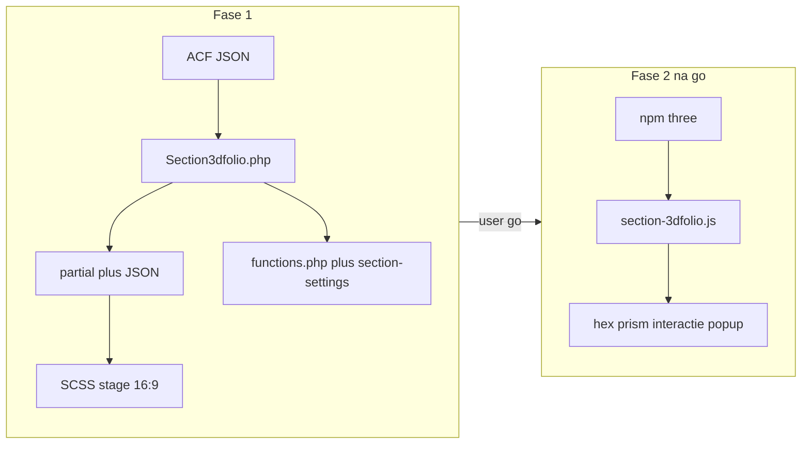

# Plan: section-3dfolio

Werken in **twee fasen**. Na fase 1 stoppen en pas verder met WebGL na expliciete go van de user.

## Beslissingen (grill, vastgelegd)

- Staande hex-prisma; cases op 6 zijvlakken (16:9, images cover); top/bottom/lege faces `#662364`
- Three.js via npm + dynamic import; stage 16:9 in `.container`; canvas transparant; camera ~25–35° van boven
- Idle yaw altijd, behalve bij open popup en `prefers-reduced-motion`
- Popup open: geen drag, geen idle; alleen cursor-tilt; DOM-billboard aan face; `role="dialog"` + focus-trap; sluiten via close-knop / Escape /zelfde face
- Touch: drag/tap parity; tilt uit of beperkt
- Data: ACF repeater naar JSON in `script type="application/json"`
- Editor: statische placeholder (geen WebGL)

## Bestandsstructuur

```
section-3dfolio/
├── Section3dfolio.php
├── partials/section-3dfolio.php
├── scss/section-3dfolio.scss
├── js/section-3dfolio.js          (fase 2; in fase 1 weglaten of minimale stub)
├── acf-json/section-3dfolio.json
└── preview/section-3dfolio.jpg    (optioneel)
```

IDs: `SECTION_SLUG = section-3dfolio`, `SECTION_ID = section_section_3dfolio`, block detectie `acf/section-section-3dfolio`.

---

## Fase 1 — Steigerwerk (nu uitvoeren bij implementatie)

Doel: sectie bestaat in WP/ACF, zichtbaar in de editor, markup + styles klaar voor de scene. **Geen Three.js, geen npm `three`, geen scene-logica.**

1. **Section3dfolio.php** — thin class zoals [SectionCards.php](public/wp-content/themes/technosapiens/sections/section-cards/SectionCards.php): `Singleton` + `SectionReferenceTrait`, `registerReferenceSection` met `hasScript = false` in fase 1 (CSS only), `getSectionLabel()`, `getCases()` (max 6; image URL, title, body via `Formatting::toHtml`).
2. **Partial** — `getContainerClasses('section-3dfolio')`, `SectionMargins`, `.container` met 16:9 `section-3dfolio__stage`, canvas-host (leeg), popup-root (leeg/verborgen), JSON script met cases, editor/no-JS placeholder.
3. **ACF JSON** — field group `Section - 3D Folio`, location `acf/section-section-3dfolio`, repeater `cases` (max 6): `case_image`, `case_title`, `case_content`. Geen margin-velden.
4. **SCSS** — `@use` mixins/vars; BEM; stage `aspect-ratio: 16 / 9`; merkkleur `--section-3dfolio-brand: #662364`; basis popup-kaart styles (nog zonder JS-positionering).
5. **Registratie** — `Section3dfolio::getInstance()` in `Theme::initBlocks()`; location-regel in [section-settings.json](public/wp-content/themes/technosapiens/acf-json/section-settings.json).
6. **Stop** — melden dat fase 1 klaar is; **niet** beginnen aan fase 2 tot de user daar om vraagt.

---

## Fase 2 — WebGL-scène (pas na expliciete go)

Doel: interactieve prisma + popup in `section-3dfolio.js`.

1. `npm install three`; zet `hasScript = true` op de section-registratie; voeg `js/section-3dfolio.js` toe.
2. Boot: parse JSON, dynamic `import('three')`.
3. Hex prism (16:9 zijvlakken); textures of solid `#662364`; top/bottom paars; transparante clear; camera ~25–35° van boven.
4. Interactie: idle yaw; drag yaw (click-threshold); raycast click; mouse parallax tilt; touch parity zonder/beperkte tilt; reduced-motion dempt idle+tilt.
5. Face-gekoppelde DOM-dialog: mee met tilt; idle+drag uit terwijl open; focus-trap; Escape/close/toggle/switch face.
6. Webpack build + smoke-check.


