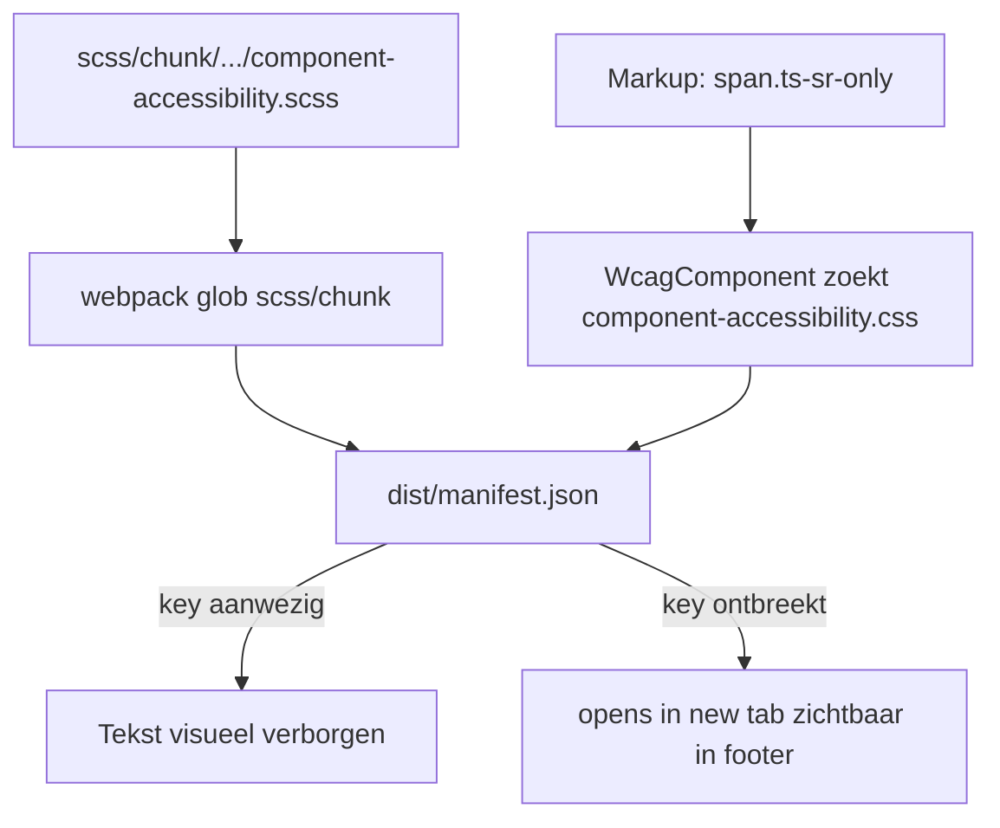

# WCAG 2.1 AA — follow-up op de oude scan

## Geldt de scan nog?

De scan kwam uit een Happy Horizon-thema (`.hh-sr-only`, `happyhorizon-frontend.scss`). In Techno Sapiens is dat **deels al gemigreerd**, maar de zichtbare "(opens in new tab)"-bug kan nog steeds optreden.

| Scan-claim | Nu |
|---|---|
| Geen `component-accessibility.scss` | **Achterhaald.** Bestand: [`scss/chunk/component/component-accessibility.scss`](public/wp-content/themes/technosapiens/scss/chunk/component/component-accessibility.scss) |
| Class `.hh-sr-only` | **Achterhaald.** Utility heet `.ts-sr-only` |
| Markup voor new-tab | **Aanwezig.** [`WcagComponent::getSrLinkOpensInNewTabHtml()`](public/wp-content/themes/technosapiens/inc/core/components/WcagComponent.php) in footer, nav, buttons |
| Skip link / focus | **Aanwezig.** Geïmporteerd in [`technosapiens-frontend.scss`](public/wp-content/themes/technosapiens/scss/technosapiens-frontend.scss) (`component-skip-link`, `component-focus`) |
| CSS in `dist/manifest.json` | **Nog onzeker.** `dist/` is gitignored. De SCSS staat in `scss/chunk/` (webpack glob → entry `component-accessibility`). [`WcagComponent`](public/wp-content/themes/technosapiens/inc/core/components/WcagComponent.php) enqueued `component-accessibility.css` alleen als die key bestaat. Ontbreekt de key, dan doet de enqueue **stil niets** — exact het oude faalpad. `.ts-sr-only` staat **niet** in `technosapiens-frontend.scss`. |

Andere AA-bouwstenen die de scan niet noemde, maar die er al zijn: `language_attributes()`, skip naar `#ts-main`, `user-scalable=yes`, landmarks (`<main>`, `<nav aria-label>`), native `<dialog>` + `inert`, `ButtonComponent` `noopener`/`noreferrer`, `Image::altFromId()`.

**Conclusie:** geen nieuwe Happy Horizon-file aanmaken. Wél bevestigen dat `.ts-sr-only` in de gebundelde CSS zit. Daarna alleen gerichte AA-gaten, geen big-bang-rewrite.

## Wat we niet doen

- Geen volledige WCAG-audit van plugins (Gravity Forms, Yoast, Polylang).
- Geen massale contrast-pass of heading-renumber van bestaande secties ([015](.cursor/rules/015-code-formatting-consistency.mdc)).
- WCAG-rule **niet** `alwaysApply` en **niet** globben op `**/*.php`. Alleen laden als de opdracht accessibility/WCAG/ARIA/alt/focus vraagt, of via `@025-wcag.mdc`.
- Niet linken vanuit [065](.cursor/rules/065-section-development.mdc) of [010](.cursor/rules/010-technosapiens-conventions.mdc) — dat zou de rule bij elke section-taak meeslepen.

## Fase 1 — `.ts-sr-only` betrouwbaar laden (P1)

Doel: footer new-tab-tekst is visueel verborgen op frontend **en** in de editor (buttons in preview gebruiken dezelfde helper).

1. `npm run build` en check `dist/manifest.json` op key `component-accessibility.css`.
2. **Als de key er is:** laten zoals het is (chunk + `WcagComponent`). Optioneel de extra HTTP-request later samenvoegen; geen functionele bug.
3. **Als de key ontbreekt:** niet een tweede `scss/component/`-kopie maken. Ofwel de webpack-key corrigeren, ofwel `@use` in `technosapiens-frontend.scss` **én** editor-bundle, en de stille enqueue verwijderen. Alleen frontend importeren is te weinig: `WcagComponent` laadt expres ook op `admin_enqueue_scripts` / `enqueue_block_assets`.
4. Browsercheck: footerlink met `target="_blank"` — "(opens in new tab)" niet zichtbaar, wél in accessibility tree.

## Fase 2 — gerichte AA-markup (P2, bestaande bugs)

Alleen deze bekende gaten; geen restyle van werkende templates.

- **Search overlay** ([`component-search-overlay.php`](public/wp-content/themes/technosapiens/inc/features/search/partials/components/component-search-overlay.php)): positieve `tabindex` 1/2/3 weg (2.4.3). Submit-knop heeft zowel `aria-label` als `aria-labelledby` op het input-id — `aria-labelledby` verwijderen (4.1.2).
- **Social icons** ([`component-social-links.php`](public/wp-content/themes/technosapiens/partials/components/component-social-links.php)): SVG met `role="img"` + `aria-hidden="true"` is tegenstrijdig. Decoratief icoon: alleen `aria-hidden="true"`. Naam zit al op de `<a>`.
- **Footer `_blank`:** [`Link`](public/wp-content/themes/technosapiens/inc/core/utils/Link.php) / `ButtonComponent` zetten `noopener`; losse footer-`<a>` niet. `rel` aanvullen als `target="_blank"`.

## Fase 3 — contrast en tokens (P3, bij wijziging)

Geen aparte contrast-sprint. Wél wanneer kleuren in [`StylingComponent.php`](public/wp-content/themes/technosapiens/inc/app/editor/StylingComponent.php) of `ts-has-dark-background` wijzigen: tekst 4.5:1, grote tekst/UI 3:1 (1.4.3 / 1.4.11). `--ts-focus-ring` / `--ts-focus-ring-inverse` moeten zichtbaar blijven op lichte én donkere vlakken (2.4.7).

## Bewust later / niet AA-verplicht

- Globale `prefers-reduced-motion`: nu alleen accordion + menu-toggle. 2.3.3 is AAA; geen blocker voor 2.1 AA.
- Heading-niveaus per sectie (`h2` + class `h3`): visueel vs semantiek is editor-content; niet massaal herschrijven.
- `Image::altFromId()` fallback naar bestandsnaam: content-probleem. Rule: decoratief `alt=""`.
- WCAG 2.2 target size (2.5.8): buiten scope.

## Fase 4 — development rules (prompt klein houden)

Patroon gelijk aan [020-security.mdc](.cursor/rules/020-security.mdc):

- Nieuw: `.cursor/rules/025-wcag.mdc` — `alwaysApply: false`, **geen globs**, description met triggers (`WCAG`, `a11y`, `aria`, `sr-only`, skip link, alt, focus, keyboard).
- Inhoud: bestaande primitives (`.ts-sr-only`, skip-link, `WcagComponent`, `ButtonComponent`, `Image::render`, `component-focus`). Geen WCAG-spec dump.
- Index alleen in [000-getting-started.mdc](.cursor/rules/000-getting-started.mdc) als agent-requestable.
- Alt voor informatief vs decoratief: drie regels in [070-image-handling.mdc](.cursor/rules/070-image-handling.mdc) (die rule laadt al bij image-werk).
- Keyboard/focus-trap blijft in [043](.cursor/rules/043-javascript-best-practices.mdc); 025 dupliceert dat niet en `mdc:`-linkt 043 niet (te groot).

Laden: `@025-wcag.mdc`, of een opdracht over accessibility / WCAG / screen reader / skip link / aria / alt / focus-visible.
